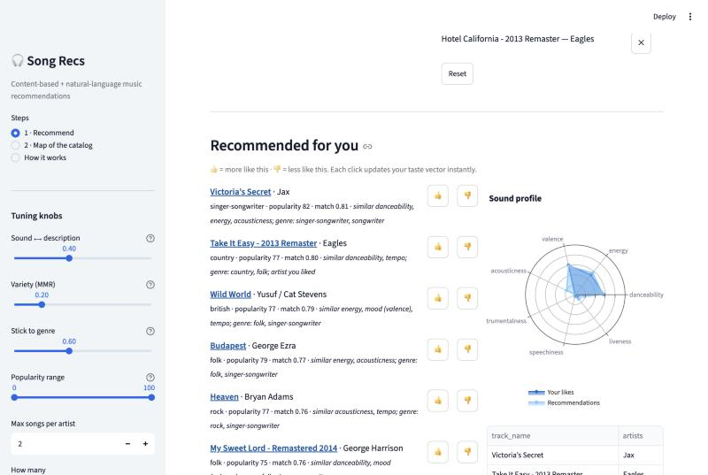

# 🎧 Song Recs

**A music recommender you can steer with songs you like *or* with plain English.**

- Pick a few songs → get recommendations that **sound** similar (tempo, energy, mood,
  acousticness…), each with a reason like *"similar energy, mood; genre: rock"*.
- Or type a vibe, *"calm piano music for focusing"*, and a **Hugging Face sentence-transformer**
  matches it against a written description of all 30,000 songs.
- 👍 / 👎 any result and your taste vector updates instantly.
- Sliders control the trade-offs every recommender faces: sound vs. description, variety vs.
  relevance, genre loyalty, and mainstream vs. deep cuts.



---

## Quickstart

```bash
git clone https://github.com/CohenTheCoder/song-recs.git
cd song-recs
python3.11 -m venv .venv && source .venv/bin/activate
pip install -r requirements.txt
python scripts/build_index.py      # one time: downloads the dataset + embeds 30k songs (~3-4 min)
streamlit run app.py
```

New to the code? **[notebooks/walkthrough.ipynb](notebooks/walkthrough.ipynb)** goes through it
step by step: download data → describe songs → load the embedding model → recommend.

---

## How it works

| Step | What happens | Tools |
|---|---|---|
| 1. Data | `hf_hub_download("maharshipandya/spotify-tracks-dataset")`: 114k Spotify tracks with audio features. Merge duplicate versions ("…– Remastered 2011"), keep the 30k most popular | 🤗 huggingface_hub, pandas |
| 2a. Audio vectors | 9 audio features → z-scores, plus one-hot genre tags × weight → unit length | scikit-learn |
| 2b. Text vectors | Each song gets a description ("hip hop song. Fast, high-energy, danceable, rap.") → 384-dim embedding | 🤗 sentence-transformers (all-MiniLM-L6-v2) |
| 3. Taste | avg(liked) − ½·avg(skipped) (Rocchio feedback), cosine similarity to every song in both spaces, blended | numpy |
| 4. Re-rank | Maximal Marginal Relevance for variety + a max-songs-per-artist cap | numpy |
| 5. Explain | Each rec says which features and genres it shares with your likes, or how well it fits your vibe | — |

Full explanation: **[docs/PROCESS.md](docs/PROCESS.md)**.

## Evaluation

There are no real listening logs here, so `scripts/evaluate.py` uses a standard proxy:
**given one seed song, what share of the top-10 share its genre?** To keep it fair, the audio
model for this test is built *without* genre tags, so it has to find same-genre songs from
sound alone. 300 random seeds:

| Model | Genre precision@10 | Diversity | Unique recs | Avg popularity |
|---|---|---|---|---|
| Random | 0.027 | 0.989 | 0.956 | 55.6 |
| Most popular | 0.032 | 0.707 | 0.003 | 97.2 |
| **Audio kNN** | **0.159** | 0.063 | 0.952 | 55.4 |
| Audio kNN + MMR (0.5) | 0.160 | 0.068 | 0.954 | 55.4 |

- Sound alone finds same-genre songs **~6× better than random**, with 111 genres to choose from.
  Many "misses" are near-genres (rock ↔ hard-rock ↔ alt-rock), so this proxy undercounts quality.
- The **most-popular** baseline shows the classic trap: the same 10 hits for everyone (0.3%
  unique) and no personalization.
- The kNN models recommend at the catalog's average popularity, so they don't just push hits.

**Limitations and next steps.** This is content-based filtering: it knows what songs sound like,
not what people actually listen to together. With real interaction data (e.g., the Spotify
Million Playlist Dataset), the next step is collaborative filtering (implicit-feedback matrix
factorization) blended with these content vectors for cold-start songs, evaluated with
playlist hold-out recall@k.

## Project structure

```
song_recs/
  data.py         # download from Hugging Face, merge duplicate versions
  features.py     # audio vectors + text descriptions + embeddings
  recommender.py  # taste vector, scoring, MMR re-ranking, explanations
app.py            # Streamlit UI (recommend + catalog map)
scripts/          # build_index.py · evaluate.py
notebooks/walkthrough.ipynb
tests/            # run on a tiny fake catalog, no downloads
```

Data: [maharshipandya/spotify-tracks-dataset](https://huggingface.co/datasets/maharshipandya/spotify-tracks-dataset) on Hugging Face (Spotify audio features).
