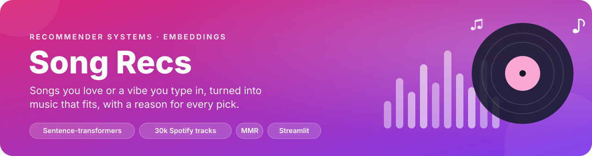
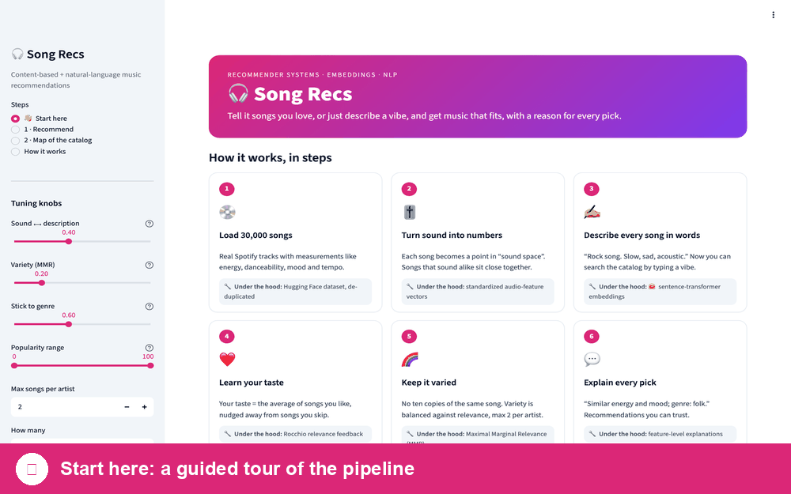
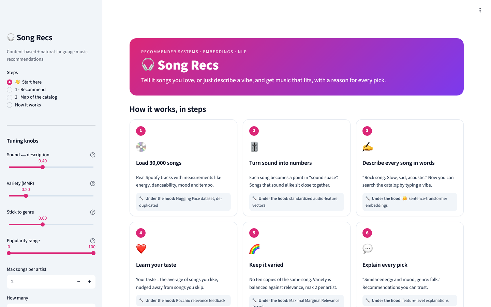
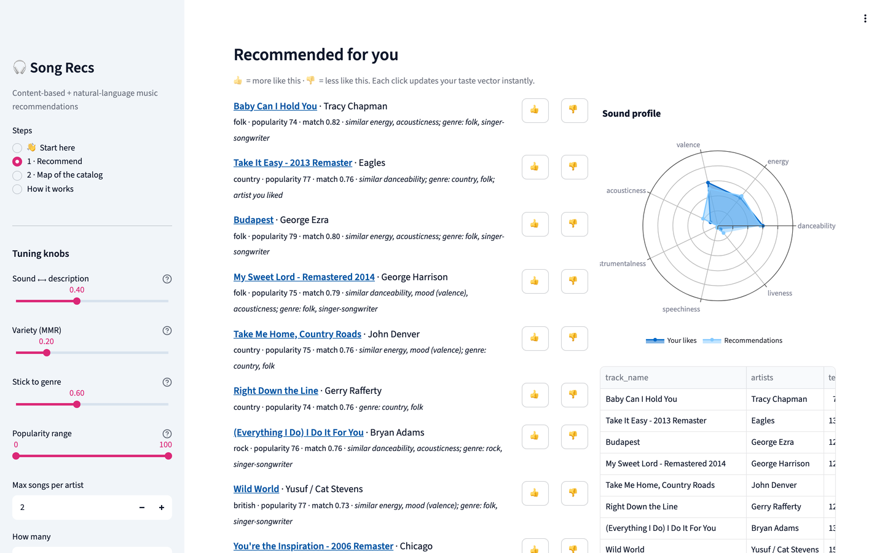
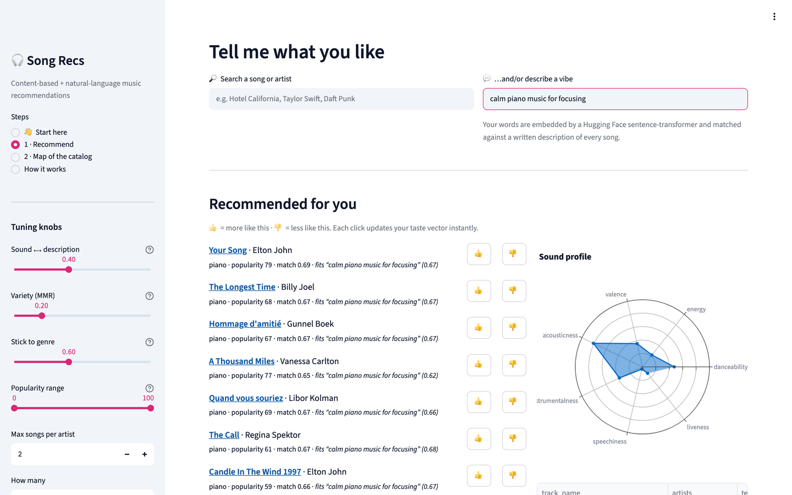
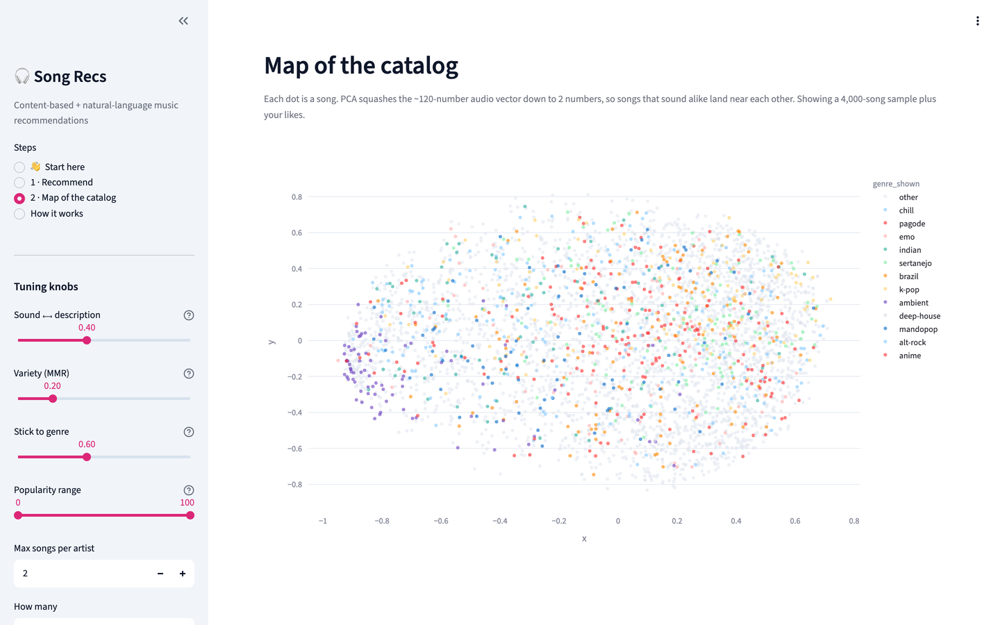
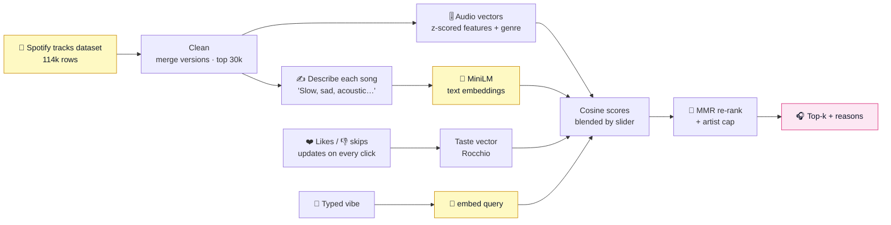

<p align="center">
  
</p>

<p align="center">
  
  
  
  
  
  
</p>

<h3 align="center">Tell it songs you love, or just describe a vibe,<br>and get music that fits, with a reason for every pick.</h3>

<p align="center">
  <a href="#tour">🗺️ Take the tour</a> ·
  <a href="#run">🚀 Run it</a> ·
  <a href="#how">🧠 How it works</a> ·
  <a href="#results">📊 Results</a> ·
  <a href="notebooks/walkthrough.ipynb">📓 Notebook</a>
</p>

<p align="center">
  
</p>

## ✨ What it does

| Feature | What happens |
|---|---|
| ❤️ **Songs like these** | Pick a few songs and get tracks that *sound* similar: tempo, energy, mood, acousticness… |
| ✍️ **Type a vibe** | *"calm piano music for focusing"*. A Hugging Face language model matches your words to a description of all 30,000 songs. |
| 👍 **Learns as you go** | Thumbs up or down and your taste updates instantly. |
| 🎛️ **You hold the knobs** | Sound vs. description, variety vs. relevance, genre loyalty, mainstream vs. deep cuts. |
| 💬 **Explains itself** | *"similar energy, mood; genre: folk"*, so every pick has a reason. |

---

<a id="tour"></a>
## 🗺️ Take the tour

The app opens on a **👋 Start here** page. One click seeds it with two classics. Here's the walkthrough.

### 👋 Start here


Six cards explain the whole recommender in plain English, each with a note on the technique underneath.

### 1 · Songs like the ones you love


Seeded with *Hotel California* and *Free Fallin'*, it suggests warm classic rock and folk, each line saying *why*. The radar chart compares the **sound profile** of your likes with the recommendations: when they overlap, the recommender is doing its job. Every title links to Spotify.

<details>
<summary>🔧 <b>Under the hood:</b> the taste vector</summary>

```python
# every song = standardized audio features (+ genre tags), scaled to length 1
taste  = A[liked].mean(axis=0) - 0.5 * A[skipped].mean(axis=0)   # Rocchio feedback
scores = A @ taste                                                # cosine similarity to all 30k songs
```
Then **Maximal Marginal Relevance** re-ranks the top 400 for variety: each pick maximizes `λ·relevance − (1−λ)·similarity to songs already picked`, with a max of 2 songs per artist.
</details>

### 2 · …or just describe a vibe


Type *"calm piano music for focusing"* and you get Elton John's *Your Song*, Billy Joel, and quiet piano pieces. There's no keyword matching: the query and the songs are compared by **meaning**.

<details>
<summary>🔧 <b>Under the hood:</b> text embeddings from Hugging Face</summary>

```python
from sentence_transformers import SentenceTransformer
model = SentenceTransformer("sentence-transformers/all-MiniLM-L6-v2")

# every song gets a generated description from its audio features…
"piano song. Slow, calm, mellow, chill, acoustic, instrumental."
# …and the query is embedded into the same 384-dimensional space
query = model.encode("calm piano music for focusing", normalize_embeddings=True)
scores = song_embeddings @ query
```
</details>

### 3 · A map of the whole catalog


PCA squashes each song's ~120-number sound vector into two dimensions. Songs that sound alike land near each other, and genres form their own neighborhoods. Your liked songs show up as ★ stars.

---

<a id="how"></a>
## 🧠 How it works



| Step | File | Technique |
|---|---|---|
| Data | [`data.py`](song_recs/data.py) | `hf_hub_download`, title normalization to merge "– Remastered 2011" duplicates |
| Vectors | [`features.py`](song_recs/features.py) | StandardScaler, multi-hot genres, generated descriptions, sentence embeddings |
| Recommend | [`recommender.py`](song_recs/recommender.py) | Rocchio taste vector, cosine similarity, MMR, artist cap, explanations |
| Evaluate | [`scripts/evaluate.py`](scripts/evaluate.py) | Genre precision@10, diversity, unique recs, popularity bias vs baselines |

New to the code? **[`notebooks/walkthrough.ipynb`](notebooks/walkthrough.ipynb)** goes step by step with output, and **[`docs/PROCESS.md`](docs/PROCESS.md)** explains everything in plain English.

---

<a id="results"></a>
## 📊 Results

With no real listening logs, [`scripts/evaluate.py`](scripts/evaluate.py) uses a standard proxy: **given one seed song, what share of the top 10 share its genre?** To keep it fair, the audio model for this test uses **no genre tags**, so it has to find same-genre songs from sound alone. 300 random seeds:

| Model | Genre precision@10 | Diversity | Unique recs | Avg popularity |
|---|---|---|---|---|
| 🎲 Random | 0.027 | 0.989 | 0.956 | 55.6 |
| 🔥 Most popular | 0.032 | 0.707 | 0.003 | 97.2 |
| 🎚️ **Audio kNN** | **0.159** | 0.063 | 0.952 | 55.4 |
| 🌈 Audio kNN + MMR (0.5) | 0.160 | 0.068 | 0.954 | 55.4 |

- From **sound alone**, it finds same-genre songs **~6× better than random**, with 111 genres to choose from. Many misses are near-genres (rock ↔ hard-rock ↔ alt-rock), so this proxy undercounts quality.
- **Most popular** shows the classic trap: the same 10 hits for everyone (0.3% unique) and no personalization.
- The kNN models recommend at the catalog's **average popularity**, so they don't just push hits.

**Limitations and next steps:** this is content-based filtering. It knows what songs *sound* like, not what people listen to *together*. With real interaction data (e.g., the Spotify Million Playlist Dataset), the next step is collaborative filtering (implicit-feedback matrix factorization) blended with these content vectors for brand-new songs, evaluated with playlist hold-out recall@k.

---

<a id="run"></a>
## 🚀 Run it in 2 minutes

```bash
git clone https://github.com/CohenTheCoder/song-recs.git && cd song-recs
python3.11 -m venv .venv && source .venv/bin/activate
pip install -r requirements.txt
python scripts/build_index.py      # one time: download data + embed 30k songs (~3-4 min)
streamlit run app.py
```

Click **▶ Try it: songs like Hotel California + Free Fallin'**, or search any song.

<details>
<summary>📁 What's in the repo</summary>

```
song_recs/              data.py · features.py · recommender.py
app.py · tour.py        Streamlit app + its "Start here" tour page
notebooks/              walkthrough.ipynb: data → descriptions → embeddings → recommend
scripts/                build_index.py · evaluate.py
docs/                   PROCESS.md, results.md, screenshots, banner
tests/                  pytest on a tiny fake catalog (no downloads)
```
</details>

## 💬 The 30-second version
*"I built a music recommender on 30,000 Spotify tracks. Songs are represented two ways: standardized audio-feature vectors, and sentence-transformer embeddings of generated text descriptions, so you can search by vibe in plain English. Likes and skips form a Rocchio taste vector, MMR re-ranking keeps the list varied, and every pick is explained. Offline, sound alone finds same-genre songs about 6× better than random without seeing genre labels, and it avoids the popularity trap that a most-popular baseline falls into."*

---

<sub>Data: <a href="https://huggingface.co/datasets/maharshipandya/spotify-tracks-dataset">maharshipandya/spotify-tracks-dataset</a> (Spotify audio features). MIT licensed.</sub>
